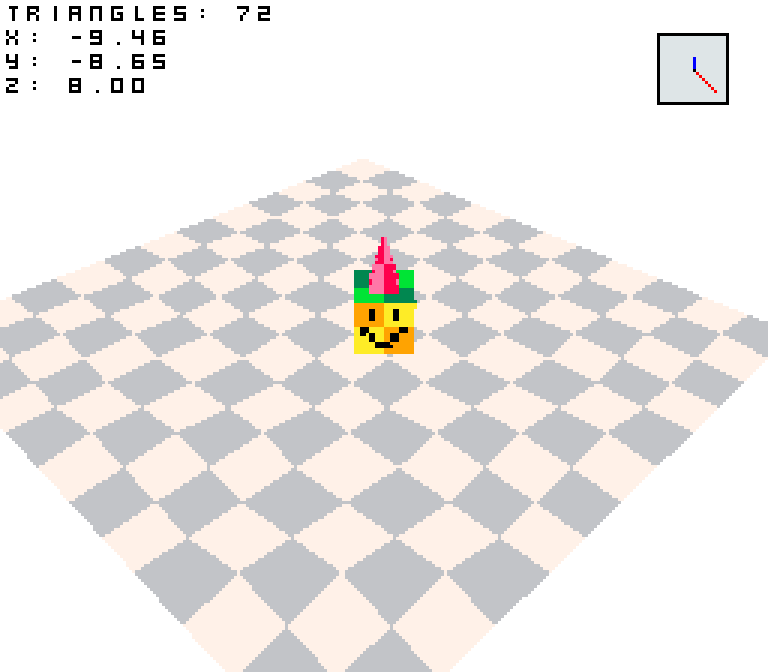

SDL2 3D
=======

This is a WIP 3D platformer written in C/SDL2 that uses SDL2's `SDL_RenderGeometry` to
make a 3D game.

Features:

 - Draw arbitrary triangle lists
 - Affine texture mapping
 - Frustum culling (only by vertex, doesn't work well with giant triangles)
 - Depth sorting (painter's algorithm, no depth buffer)